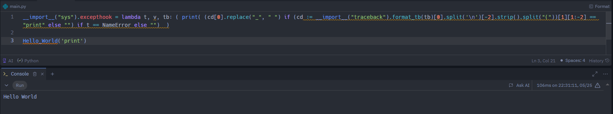
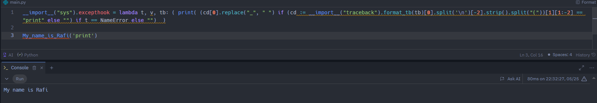
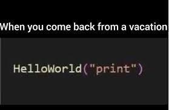

# Opposite Print Function

## Overview

This project showcases a Python script that does the reverse of the traditional `print("Hello World")` statement. Instead, it allows the function call `Hello_world("print")` to output "Hello World".

The main idea behind this project is to provide a fun and challenging twist on the standard `print` function, inspired by a meme. While it serves no practical purpose, it can be a source of entertainment and a learning exercise for those who enjoy exploring unconventional coding techniques.

## Code Explanation

The script overrides Python's default exception handling to achieve the desired functionality. Here's a brief breakdown of how it works:

- It sets a custom exception hook using `sys.excepthook`.
- When a `NameError` is encountered, it checks if the error is due to a function call containing the string "print".
- If the conditions are met, it extracts the function name, replaces underscores with spaces, and prints it.

Here is the code:

```python
__import__("sys").excepthook = lambda t, v, tb: (
    print(
        (cd[0].replace("_", " ") if (cd := __import__("traceback").format_tb(tb)[0].split('\n')[-2].strip().split("("))[1][1:-2] == "print" else "")
        if t == NameError
        else ""
    )
)

Hello_world('print')
```

### Examples:

## hello_world("print")
In this example, calling `Hello_world('print')` results in the output `Hello World`. Similarly, calling any non-existent function with the argument `"print"` will output the function name with underscores replaced by spaces. For instance, `Goodbye_world('print')` would result in the output `Goodbye World`.



## Another use case
This example shows that any non-existent function name followed by the argument `"print"` will be printed, not just `Hello_world("print")`.



## Inspiration
My inspiration for this glorious project.


